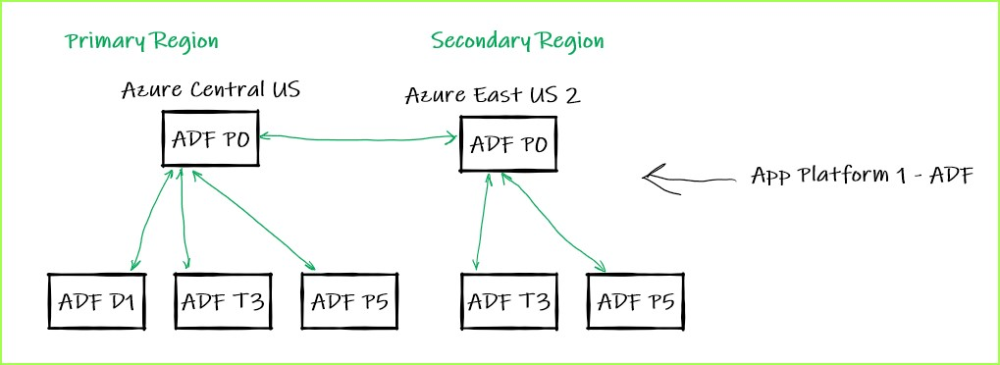
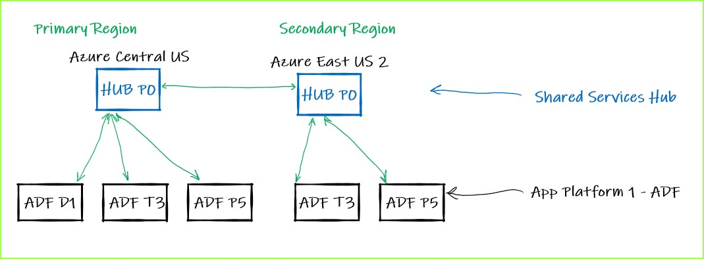
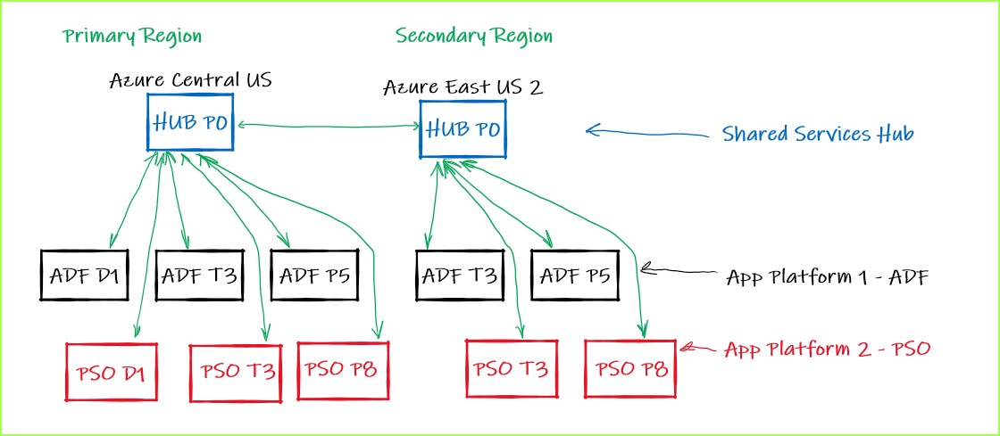
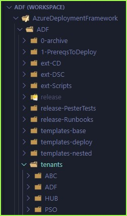
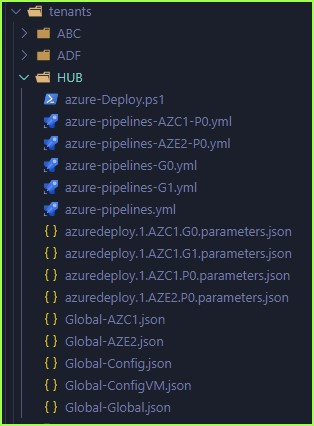
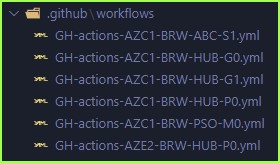

#  Observations on ARM (Bicep) Templates # 

## - Azure Deployment Framework ## 
- Go Home [Documentation Home](./index.md)
- **Go Next** [App Tenants Descriptions](./App_Tenants_Descriptions.md)

### App Tenants

The Framework supports deploying Multiple Applications, each application is referred to as a Tenant within the ADF.

A single DevOps Team owns all of the deployments for all of the tenants in the projects, including all release pipelines.

If you only have a single Tenant, you can just deploy the HUB/Spoke Environments from a single tenant.

####  App (Tenant) "ADF"

You may adopt a Shared Services HUB tenant and all other tenants will only have Spoke environments.

#### Shared Services Hub - Supporting App (Tenant) "ADF"

#### Shared Services Hub - Supporting Apps (Tenants) "ADF" & "PSO"

You can easily deploy all Tenants (Apps) into the same subscription, however you can also deploy across or into multiple Subscriptions.

####  Apps shown in project files (tenants directory, with each tenant/App)

Each Tenant has it's own dedicated directory, that contains the Environment Meta Data for that Application.

- Parameter Files
    - 1 per Environment (Can be a Hub or a Spoke, aligned with a Resource Group)
        - Hub [P0](./Deployment_Partitions.md)
        - Spoke E.g. [S1](./Deployment_Partitions.md)
            - You can clone a entire environment by Cloning a parameter file and giving it a new name e.g. S2
    - 1 Aligned with the App Tenant - Global [G1](./Deployment_Partitions.md)
    - 1 Aligned with the Subscription - Global [G0](./Deployment_Partitions.md)
- Global-Global - Global config for that tenant/App
- Global-Config - Global config for that tenant/App
- Global-ConfigVM - Global config for that tenant/App
- Global-AZC1 - Global config for that region
- Global-AZE2 - Global config for the partner region (Primarily a DR region)
- Deployment Pipeline Yaml files (as shown for Azure DevOps, GitHub Workflows are in a separate .github directory)
- azure-Deploy.ps1 - This is the main Deployment Script for ALL Manual (Non-Pipeline) Deployments.
    - Samples of deploying to any Environment are in this script
    - You can deploy from scratch with these commands
        - Bootstrap commands are included in this file
    - These are the exact same commands that are exectuted within the Pipelines
        - Often you need to only execute a more granular deployment e.g. testing/dev
    - All deployments from this project are PowerShell based, so you are not tied to any single Deployment Platform
        - You can deploy from Azure Cloud shell
        - You can deploy from PowerShell on your local machine
        - You can deploy from GitHub workflow using the 'azure/login@v1' and 'Azure/powershell@v1' Actions
        - You can deploy from Azure DevOps using the 'AzurePowerShell@5' task
        - You can deploy from other tools e.g. Jenkins Etc.
        - You can deploy using Azure Template Specs (Preview)
            - You can build Azure BluePrints from those Template Specs (Preview)

####  Apps shown in project (tenants directory, with each tenant/App) and associated Meta Data Files

####  GitHub Workflow Files for Tenants/Environments

---
