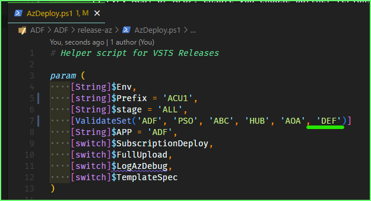

#  Observations on ARM (Bicep) Templates

## - Azure Deployment Framework docs sections
- Go: [README](https://github.com/brwilkinson/AzureDeploymentFramework#readme){:target="_blank"} (GithHub Home)
- **Go Home** [Documentation Home](./index.md)
- **This Page** [Deploy your First App](./Getting_Started.md)
- **Go Next** [Deploy your Second App](./Getting_Started2.md)

### Getting Started
##### *Azure Resource Group Deployment - Multi-Region/Multi-Tier Hub/Spoke Environments*

#### Setup Steps

1) Fork the Repo
1) Clone the Repo
    1) `set-location -Path D:\Repos`
    1) `gh repo clone <yourProjectForkName>/AzureDeploymentFramework ADF`
1) Review the Tools/Setup [Tools Setup](./Tools_Setup.md)
1) Open the cloned repo in VSCode Insiders
    1) `code-insiders .\ADF\ADF.code-workspace`
    1) Accept the install of the Extensions
    1) Ctrl+ J to open the console in vscode
    1) I also recommend having a second window Open in the (Windows or other) Terminal
1) Now you can create your own App Tenant directory.
    1) Choose your AppName e.g. **DEF**
    1) Just copy one of the existing, such as AOA.
        1) `mkdir .\ADF\tenants\DEF`
        1) `Copy-Item -Path .\ADF\tenants\AOA\* -Destination .\ADF\tenants\DEF\ -Recurse`
        1) We validate the tenant names in 3 places, so add your new tenant name
            1) Edit this file `ADF\release-az\Start-AzDeploy.ps1`
                1) Add the new tenant/app Name e.g. 'DEF' to the validateset
                
                
            1) Edit this file `ADF\release-az\azSet.psm1`
                1) Add the new tenant/app Name e.g. 'DEF' to the validateset
                
                
            1) Edit this file `ADF\release-az\AzDeploy.ps1`
                1) Add the new tenant/app Name e.g. 'DEF' to the validateset
                
                
        1) Update the 'AppName' in `.\ADF\tenants\DEF\Global-Global.json` to match **DEF**
        1) Update the 'OrgName' in `.\ADF\tenants\DEF\Global-Global.json` to match your Team name **NYC**
    1) You can Choose your Primary and Secondary Azure Deployment Regions
        1) E.g. ACU1 or AEU2, ensure you choose partner regions in Azure
        1) Your deployment can be HA across these regions or simply used for DR
    1) Choose what Enviro you want to deploy to in each Region
        1) S1 for a Sandbox 1 Environment
        1) D4 for a Developent 4 Environment
        1) U6 for a UAT 6 Environment
        1) P7 for a Production 8 Environment
    1) Based on the Previous 2 steps you can delete any files or update the names to match your requirements
    1) You need 1 Global-Prefix.json file Per Region that you want to deploy into
        1) Update the Network ranges in these files so they are unique per region that you choose
    1) There are some ADO Pipeline files you can come back to these.
    1) There is an azure-Deploy.ps1 that has some of the deployment steps to actually deploy out each Enviro.
        1) you can rename the parameters in that file to match your chosen tenant name E.g. ADF
        1) Plus you can rename the Enviro to the Deployment partition that you wish to deploy E.g. G1
            1) Deployment Partitions [Deployment Partitions](./Deployment_Partitions.md)
1) Now you should be ready to deploy.
1) Ensure you are logged into Azure and are set to the correct Subscription and Context
1) There are some more Pre-Req. steps, however you may not need these straight away
    1) [Getting Started Pre-reqs](./Getting_Started_PreReqs.md)
        1) Create storage account for artifacts e.g. vm extension files
        1) Create keyvault for secrets and certs
        1) Create a self signed web cert, if needed for Virtual Machines or VMSS etc.
        1) Export out role definitions that are custom to your Subscription/Tenant
        1) Create service principals for ADO deployments + connectors
        1) Create service principals for GitHub deployments + secrets
        1) Sync keyvault secrets and certs from the primary region to a secondary region

#### Deploy Steps

```powershell
# I recommend to put this in your own Powershell profile, so it's loaded by default
New-Variable -Name Repos -Value 'D:/Repos' -Scope Global -Force
$null = New-PSDrive -Name AZ -PSProvider FileSystem -Root $Repos -EA 0
Set-Location -Path AZ:
Import-Module oh-my-posh
Set-PoshPrompt -Theme $PoshPromptPath
Import-Module posh-git
Import-Module Terminal-Icons
Import-Module Az.Accounts
Import-Module -Name $Repos/ADF/ADF/release-az/azSet.psm1 -Scope Global -Force

```

Now in the Terminal you can setup your Enviro for the Tenant and (Enviro) Deployment Partition that you want to deploy.
Set the location to the project ADF cloned repo directory
- `Set-Location -Path ADF`
Execute the AzSet command to select your `app tenant` and `Enviro`
- `azset -App DEF -Enviro G0`
The `AzSet` function also sets an Enviro Variable so you can track this setting in your prompt
- `$env:Enviro = "${App} ${Enviro}" # add this to track on prompt (oh-my-posh env variable)`
- This can be viewed here: [Install-Tools.ps1](https://github.com/brwilkinson/AzureDeploymentFramework/blob/main/ADF/1-prereqs/00-InstallTools.ps1#L157)
    ```json
    {
        "type": "text",
        "style": "powerline",
        "properties": {
            "template": "{{ .Env.Enviro }}"
        },
        "powerline_symbol": "",
        "foreground": "#6d1d24",
        "background": "#73e600"
    }
    ```


Once this setup has been complete you can look at the docs for the following:
- [Orchestration Templates](./Orchestration_Templates.md)
- [Base Templates](./Base_Templates.md)