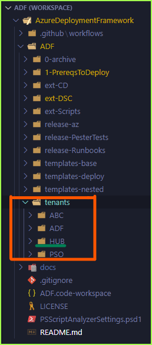
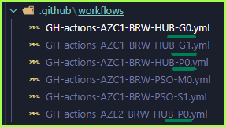

#  Observations on ARM (Bicep) Templates # 

## - Azure Deployment Framework ## 
Go Home [Documentation Home](./index.md)

### Getting Started - Deploy your Second App
- [Documentation - Getting Started - Deploy your First App](./Getting_Started.md)

#### *Azure Resource Group Deployment - Multi-Region/Multi-Tier Hub/Spoke Environments*

#### This project assumes:
- Shared Subscription between all Apps/Tenants
- Shared Hub between all Apps/Tenants
- Shared Global resource Group between all Apps/Tenants

### Why Shared? Because this project should be managed by a single SRE/DevOps team.
<br/>

### Pre requisites

1. You already deployed G0,G1,P0 Environments in 2 regions
    1. if not go here and do that first [Deploy your First App](./Getting_Started.md)
    1. Assume you deployed out the HUB Tenant/Environments

        

    1. This would mean you have a Workflow deployment for
        1. Subscription G0
        1. Global Resource Group G1
        1. A Primary Hub RG P0
        1. A Secondary Hub RG P0

            

    1. This means you have Resource Groups for
        1. Global Resource Group G1
        1. A Primary Hub RG P0
        1. A Secondary Hub RG P0
        
            

    1. Those Resource Groups represent Shared Resources in a Hub
        1. You could continue to Create Spokes in the same Tenant (HUB), however it makes sense to use a different Tenant Name for your Application Resources, that way you can eventually continue to have multiple Applications/Tenants, that share the same HUB tenant.
    
    1. So lets start the Configuration of the 2nd Tenant/Application, I will demo with the ABC tenant. You can clone these App/Tenant Directories E.g. HUB/ABC/ADF/PSO and rename them for new Tenants/Apps that you have.
        1. I recommend cloning a tenant that is already working, then just go through and update the appropriate settings.
            1. However feel free to just use HUB and ABC and we will update the ABC files now
        1. Each App Name should always be limited to 3 Characters
        1. Always Share the same OrgName in all tenants
        1. Always use different Network Ranges in Each Tenant/Application, to avoid overlapping IP Addresses
            1. This also allows you to deploy either 8 or 16 Environments in each App/Tenant

## Steps

1. There are several setup/management scripts in this directory: ADF\1-prereqs
1. There are several shared metadata files in your Tenant Directory e.g. Global-Global.json, Global-ACU1.json, Global-AEU2.json
1. We will now move to the ABC Tenant, this is only going to have Spoke Environments
    1. ABC will use the HUB environment for the Spoke e.g. Network and Keyvaults
    2. ABC will use the HUB Global Resource, this is shared Global resources e.g. storage accounts.
1. Open the following File and fill out all of the information ADF\tenants\ABC\Global-Global.json
    1. All of the info below should be filled out ahead of time
    1. Replace the 3 Characters that map to the Name of your App, in this case ABC, you can leave ABC (unless you cloned it for a different App Name).
        ```json
          "Global": {
            "OrgName": "BRW",
            "AppName": "AOA",
            "GlobalSA": {
              "namesuffix": "global"
            },
            "GlobalRG": {
              "name": "G1" // comment out for global in local
            },
            "PrimaryLocation": "CentralUS",
            "SecondaryLocation": "EastUS2",
        ```
1. Open the following File and fill out all of the information ADF\tenants\ABC\AZC1-Global.json
    1. The file name should match your Primary Azure Region that you will deploy into
        1. Most settings stay the same, since we will be referencing the HUB
        1. Update the NetworkID to a new /20 range for this tenant/App
            ```json
            {
              "Global": {
                "hubRG": {
                  "name": "P0"
                },
                "hubVN": {
                  "name": "vn"
                },
                "hubKV": {
                  "name": "VLT01"
                },
                "hubAA": {
                  "name": "OMSAutomation"
                },
                "networkId": [ // A different range for each region
                  "172.16.",
                  144
                ],
                "DNSServers": [ // Leave Empty to use AzureDNS
                  "172.16.144.75",
                  "172.16.144.76"
                ],
                "AALocation": "EastUS",
                "RTName": "Hub",
                "shutdownSchedulerTimeZone": "Eastern Standard Time",
                "patchSchedulerTimeZone": "America/New_York"
              }
            }
            ```
1. Open the following File and fill out all of the information ADF\tenants\ABC\AZE2-Global.json
    1. The file name should match your Secondary Azure Region that you will deploy into
    1. This will have a different network range etc, this is for DR
    1. Fill out the appropriate information, including the Keyvault and RG name references, since we will bootstrap those in both regions.
        ```json
          {
            "Global": {
              "hubRG": {
                "name": "P0"
              },
              "hubVN": {
                "name": "vn"
              },
              "hubKV": {
                "name": "VLT01"
              },
              "hubAA": {
                "name": "OMSAutomation"
              },
              "networkId": [ // A different range for each region
                "172.18.",
                144
              ],
              "DNSServers": [ // Leave Empty to use AzureDNS
                "172.18.144.75",
                "172.18.144.76"
              ],
              "AALocation": "EastUS",
              "RTName": "Hub",
              "shutdownSchedulerTimeZone": "Eastern Standard Time",
              "patchSchedulerTimeZone": "America/New_York"
            }
          }
        ```
1. Open up the Helper Script [ADF\tenants\ABC\azure-Deploy.ps1]
    1. Ensure the correct App Name is set and we can set it to S1, our First Environment (Sandbox1)
        ```powershell
        # F5 to load
        $ADF = Get-Item -Path "$PSScriptRoot\..\.."
        $App = 'ABC'
        $Enviro = 'S1'
        ```
    1. In order to Load some settings into memory, once you open that file you press F5 to load it.
    1. You should see something similar to the following after you run F5
        ```powershell
        VERBOSE: ArtifactStagingDirectory is [D:\repos\AzureDeploymentFramework\ADF] and App is [ABC]
        ```
1. Create your Service Principals (Scripts are provided for GitHub and Azure DevOps), this document assumes GitHub
    1. This will create 1 Principal per Resource Group, Per Application
        1. Lets say we create Sandbox1, Development2 and Test3 Environments in the Primary
        1. Lets say we create only a Sandbox1 Environment in the Secondary Site.
    1. You can go ahead and create all of them ahead of time, if you like
    1. You can always come back add more or also re-run this, it will check if they exist
    1. Execute this following line/s (One for each region)
        ```powershell
        # Create Service principal for Env.
        . ADF:\1-prereqs\4-Start-CreateServicePrincipalGH.ps1 -APP $App -Prefix AZC1 -Environments S1,D2,T3
        . ADF:\1-prereqs\4-Start-CreateServicePrincipalGH.ps1 -APP $App -Prefix AZE2 -Environments S1
        ```
        1. Sample Output, this does several things
            1. Create the Application/Service Principal in Azure ActiveDirectory
            1. Creates the Secret in GitHub, this is used for Deployments (GitHub Workflows/Actions)
            1. Updates the Global-Global.json file to do friendly name lookups for the ServicePrincipal to the objectid
                ```powershell
                Secret                : System.Security.SecureString
                ServicePrincipalNames : {7e12ee90-b923-443a-94a0-7defeed41202, http://AzureDeploymentFramework_AZE2-BRW-ABC-RG-S1}
                ApplicationId         : 7e12ee90-b923-443a-94a0-7defeed41202
                ObjectType            : ServicePrincipal
                DisplayName           : AzureDeploymentFramework_AZE2-BRW-ABC-RG-S1
                Id                    : 29ff09fe-c261-46e9-9566-d4c834d1521f
                Type                  :
                
                WARNING: Assigning role 'Reader' over scope '/subscriptions/1f0713fe-9b12-4c8f-ab0c-26aba7aaa3e5' to the new service principal.
                
                {"clientId":"7e12ee90-b923-443a-94a0-7defeed41202","clientSecret":"fffbd501-4f87-453c-b765-95f3d2db0a17","tenantId":"3254f91d-4657-40df-962d-c8e6dad75963","subscriptionId":"1f0713fe-9b12-4c8f-ab0c-26aba7aaa3e5","activeDirectoryEndpointUrl":"https://login.microsoftonline.com","resourceManagerEndpointUrl":"https://management.azure.com/","activeDirectoryGraphResourceId":"https://graph.windows.net/","sqlManagementEndpointUrl":"https://management.core.windows.net:8443/","galleryEndpointUrl":"https://gallery.azure.com/","managementEndpointUrl":"https://management.core.windows.net/"}
                
                ✓ Set secret AZE2_BRW_ABC_RG_S1 for brwilkinson/AzureDeploymentFramework
                
                VERBOSE: Adding Service Principal [AzureDeploymentFramework_AZE2-BRW-ABC-RG-S1] to Global-Global.json
                
                benwilk@Microsoft.com                       : b8214ecb-d982-402b-8185-ca909b853eec
                AzureDeploymentFramework_AZC1-BRW-ABC-RG-S1 : 39420256-6589-4a68-a777-994809dc824b
                AzureDeploymentFramework_AZC1-BRW-ABC-RG-D2 : 494b32a2-888f-42c5-8f44-688c18f7ab04
                AzureDeploymentFramework_AZC1-BRW-ABC-RG-T3 : 5cf9039b-2c80-4e83-86cf-c3a383e067de
                AzureDeploymentFramework_AZE2-BRW-ABC-RG-S1 : 29ff09fe-c261-46e9-9566-d4c834d1521f
                ```
1. That now completes the Setup
    1. however we can now work on ensuring the correct Workflows are present
    1. we can ensure that the correct resources are setup in each Parameter file for the new environments.
1. Some differences that you should know about in the Spokes or Secondary application Environment
    1. Lets start by looking at the sample Environment Parameter file [ADF\tenants\ABC\azuredeploy.1.AZC1.S1.parameters.json]
        1. Notice below now, we have to add the Tenant Property on the "SPInfo"
        1. This setup up the RBAC/Role Assignments, since it's across tenants, you just add the HUB tenant in.
        1. Notice Contributor doesn't need that change, since it's going to assign this SP as Contributor on the current Resource Group Scope.
        ```json
        "SPInfo": [
                  {
                    "Name": "AzureDeploymentFramework_AZC1-BRW-ABC-RG-S1",
                    "RBAC": [
                      {
                        "Name": "Contributor"
                      },
                      {
                        "Name": "Reader and Data Access",
                        "RG": "G1",
                        "Tenant": "HUB"
                      },
                      {
                        "Name": "Storage Account Key Operator Service Role",
                        "RG": "G1",
                        "Tenant": "HUB"
                      },
                      {
                        "Name": "Log Analytics Contributor",
                        "RG": "G1",
                        "Tenant": "HUB"
                      },
                      {
                        "Name": "Automation_Account_Contributor",
                        "RG": "P0",
                        "Tenant": "HUB"
                      },
                      {
                        "Name": "Key_Vault_Reader",
                        "RG": "P0",
                        "Tenant": "HUB"
                      },
                      {
                        "Name": "Key Vault Secrets User (preview)",
                        "RG": "P0",
                        "Tenant": "HUB"
                      },
                      {
                        "Name": "Network Contributor",
                        "RG": "P0",
                        "Tenant": "HUB"
                      },
                      {
                        "Name": "DNS Zone Contributor",
                        "RG": "P0",
                        "Tenant": "HUB"
                      },
                      {
                        "Name": "DNS Zone Contributor",
                        "RG": "P0",
                        "Tenant": "HUB",
                        "PREFIX": "AZE2"
                      }
                    ]
                  }
                ]
        ```
    1. There are some other differences, such as less Network Resources deployed e.g. Gateway/Firewall/Network watcher
    1. Also there are no Private DNS zones deployed in spokes
    1. There will be a KeyVault Deployed, for the individual Application
        1. The Keyvault in each HUB is used for template deployments and is not on the Private Link
        1. The Keyvault in each Spoke is used for the Application is connected to the VNET via Private Link
