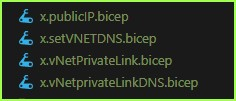

#  Observations on ARM (Bicep) Templates # 

## - Azure Deployment Framework ## 
- Go Home [Documentation Home](./index.md)
- Go Home [Naming Standards](./Naming_Standards.md)

### Naming Standards Bicep - These are a work in progress.

#### *Azure Resource Group Deployment - Multi-Region/Multi-Tier Hub/Spoke Environments*
 

    Common naming standards/conventions/examples for Bicep:

    Bicep is new, so this is a work in progress and subject to change.

- Currently ALL Bicep files are in the same directory e.g. [bicep](https://github.com/brwilkinson/AzureDeploymentFramework/tree/main/ADF/bicep)
- Files that begin with 'sub' E.g. sub-XYX.bicep should be deployed into the Subscription Scope.
- There are some Parent Deployments, one for Subscription Scope and one for the Resource Group Scope.
    - 00-ALL-SUB.bicep
    - 01-dp-rg-ALL.bicep
- The above files will orchestrate full deployments, since they only call child Bicep Modules. These are what you call in your pipelines.
- Each resource type has a main file to deploy that resource and associated capabilities e.g. storage is SA.bicep
- That main bicep file will use bicep Modules to deploy components that are related and also to loop through arrays of those items E.g. storage accounts
    - These related modules will start with the same name, then have a dash E.g. SA-Storage.bicep
    - So you would never call that file directly, you would only call SA.bicep in a deployment for storage accounts.
    - The above nesting can be multiple levels e.g. sub-RBAC.bicep --> sub-RBAC-ALL.bicep --> sub-RBAC-ALL-RA.bicep
        - Again you would only ever want to deploy **sub-RBAC.bicep**, not the children.
        
            

- Use a dot notation for segmenting Resource types into more descriptive categories
    - An example is: SA.bicep for storage OR SA.CDN.bicep for a CDN
    - The dot allows for more specific names to describe the bicep file, however diferentiates the dash used for nested deployments.
- In the ARM (Bicep) Templates, numbers are used on the templates, however no numbering has been implemented here so far, except on the parent deployments mentioned above.
- Any deployment names to Bicep modules will begin with 'dp', these are used for the deployment names e.g. in the Portal.
- Currently some parameter names that have been migrated from ARM templates will maintain the casing, which is not camel case
    - Where it makes sense camel case will be used for param/variable/resource names, where it doesn't break backwards compatiblity

- Helper functions are currently prefixed with an x.file.bicep, these are reusable bicep modules that can be called from more than 1 parent module.

    
---
